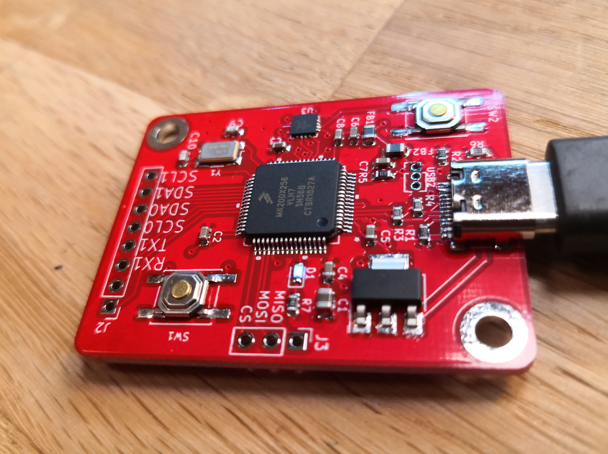

# Teensy3.2-example
A verified example PCB based on the Teensy 3.2 schematics. This repository holds the Kicad files to create your own Teensy 3.2 PCB. Design notes can be found on [my blog](https://flashgamer.com/blog/comments/teensy-3.2-kicad-example).

I'm a consultant based in Oslo/Norway, so [get in touch](https://maketronics.no/about/) if you need custom hardware based on Teensy 4.x (Since Teensy 3.x is no longer feasible due to parts shortage)

Pictures of the finished board can be [found here](images/).

